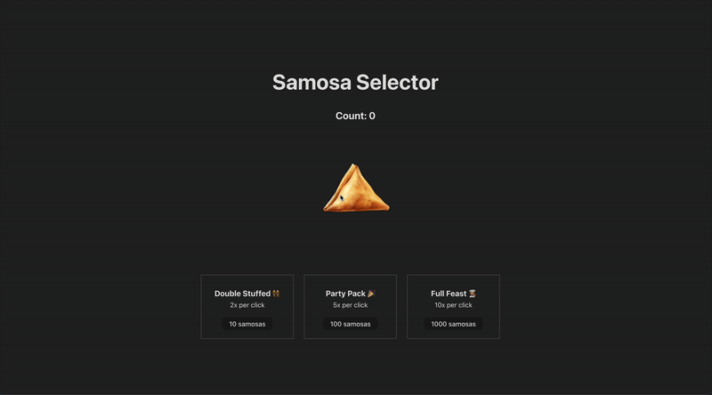

# Samosa Selector

Samosa Selector is a fun clicker game where users collect samosas and upgrade their multiplier to increase their samosa count per click.

## Features
- Click the samosa image to increase your count.
- Upgrade your click power by purchasing upgrades with collected samosas.
- Three upgrade options:
  - **Double Stuffed (👯‍♀️)**: Doubles your click power for 10 samosas.
  - **Party Pack (🎉)**: Multiplies click power by 5 for 100 samosas.
  - **Full Feast (👩🏽‍🍳)**: Multiplies click power by 10 for 1000 samosas.

## Preview


## Installation
1. Clone the repository:
	```sh
	git clone https://github.com/Ruhisawant/Samosa-Selector-App.git
	cd samosa-selector
	```
2. Install dependencies:
	```sh
	npm install
	```
3. Start the development server:
	```sh
	npm start
	```

## Technologies Used
- React
- JavaScript (ES6+)
- CSS

## License
This project is open-source and available under the [MIT License](LICENSE).